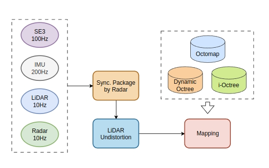
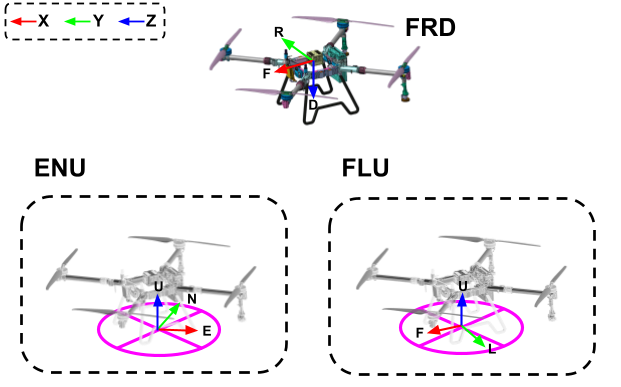
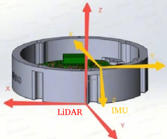

# AgriLiRa4D_Mapping

***Mapping package for "AgriLiRa4D: A Multi-Sensor UAV Dataset for Robust SLAM in Challenging Agricultural Fields".***



**Supported Platforms**

- ROS-Noetic on Ubuntu20.04
<!-- - ROS-One on Ubuntu22.04 -->

## Third-party

- PCL
- Eigen3
- Octomap

## Run

```bash
# build
mkdir -p ws_agrilira4d/src
cd ws_agrilira4d/src
git clone git@github.com:zhan994/AgriLiRa4D_Mapping.git
cd ..
catkin_make

# run
source devel/setup.bash
roslaunch mapping mapping.launch
```


## Notes

**Ground-Truth Odometry for FRD (Body) in FLU**



**Extrinsics for Robosense Airy LiDAR**




